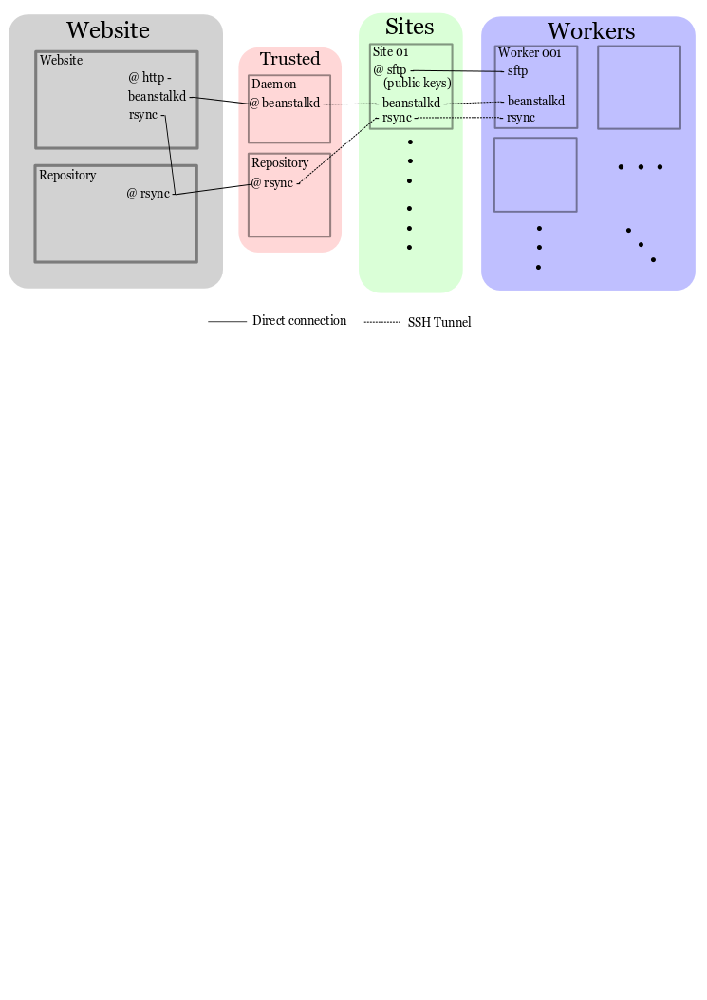

Network Layout
===================
Here, we intent to layout a rough network diagram of how computers are connected in the OpenKIM network.

Network tools
-------------
We rely on a large set of standard networking tools to allow the resources to live in the
nethers of the internet.  SSH tunnels are employed to limit host dependencies on non-native
port access - ssh is standard on any \*nix system and is highly restricting is configured correctly.  
SFTP allows the transfer of these secure resources via authenticated download - the users
of this system can be greatly restricted for security purposes.  RSYNC is used in the system for
file transfer as well as it transfers only the changes of files to reduce network overhead - this 
is tunneled through ssh for security).  BEANSTALKD is the queue we have chosen for its simplicity
and implementation in C, Python, and Ruby.  

Diagram
--------

Description
-----------
This is a proposed wiring diagram of the OpenKIM compute network.  On the least secure side are the workers which
are distributed to various computing resources that have varying levels of security.  These first connect
via interactive password authentication to a Site's sftp server.  There, it retrieves that Site's key
necessary to connect.  When the director/worker comes online, it makes two ssh tunnels to the site computer, one 
to the beanstalkd daemon, the other to rsync.  

These sites are then port forwarded to a Trusted machine via another set of SSH keys.  These are the critical machines
for the worker side of things.  They host the beanstalkd queue and the rsync from which the workers and directors draw
the information needed to run jobs.  

SSH and sftp
------------
These two tools are used in very standard ways.  As their complexity increases, documentation will appear here.

Beanstalkd
----------
The beanstalk daemon we are running has a few tubes open that are non-standard.

1. "jobs" - These are JSON encoded strings representations of jobs.  They include test-model pair and its dependencies
2. "results" - These are JSON encoded strings of the test-model pair results.  Also includes extra profiling information. These are consumed by the website.
3. "update" - This is the tube which the website sends pings to the worker.  This can include a priority flag which is one of `immediate`, `very high`, `high`, `normal`, `low`, and `very low`. 
4. "errors" - These are the errors returned by a worker.  These are consumed by the directors.  
