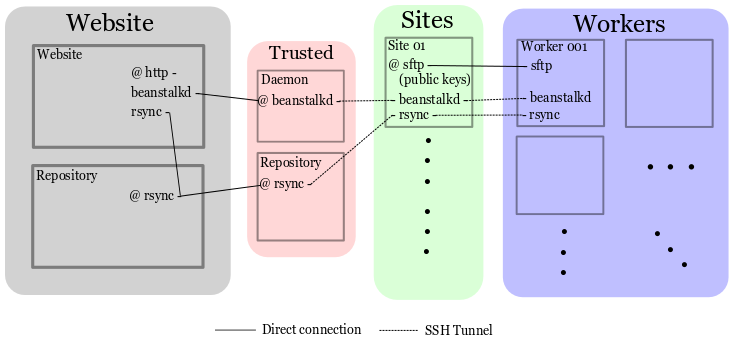

OpenKIM Network 
===================
Here, we intent to layout a rough network diagram of how computers are connected in the OpenKIM network.

Diagram
--------

Description
-----------
This is a proposed wiring diagram of the OpenKIM compute network.  On the least secure side are the workers which
are distributed to various computing resources that have varying levels of security.  These first connect
via interactive password authentication to a Site's sftp server.  There, it retrieves that Site's key
necessary to connect.  When the director/worker comes online, it makes two ssh tunnels to the site computer, one 
to the beanstalkd daemon, the other to rsync.  

These sites are then port forwarded to a Trusted machine via another set of SSH keys.  These are the critical machines
for the worker side of things.  They host the beanstalkd queue and the rsync from which the workers and directors draw
the information needed to run jobs.  
